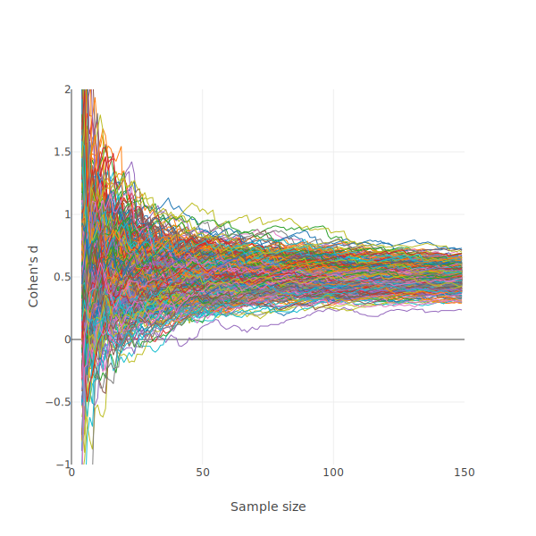
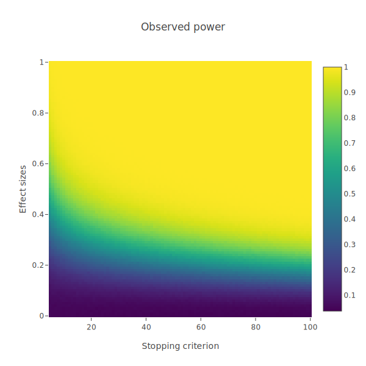
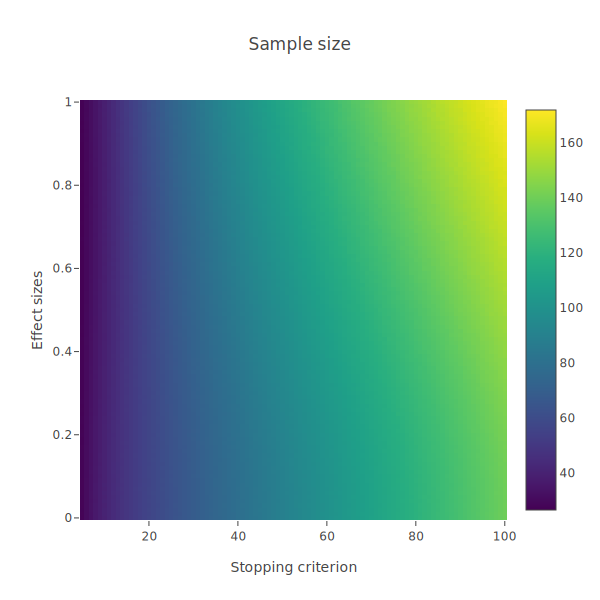
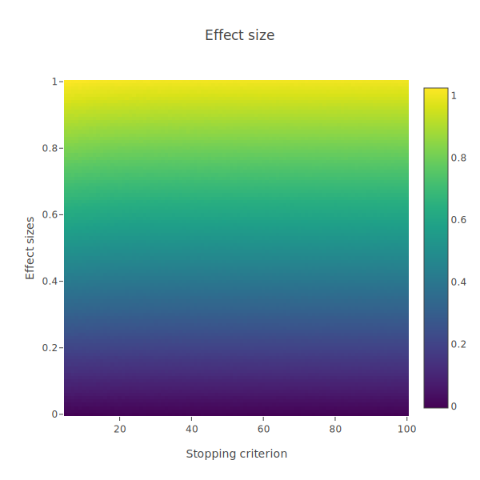
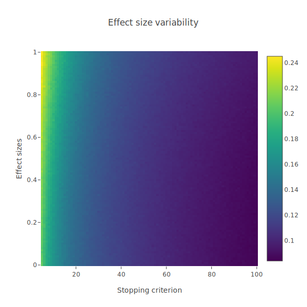
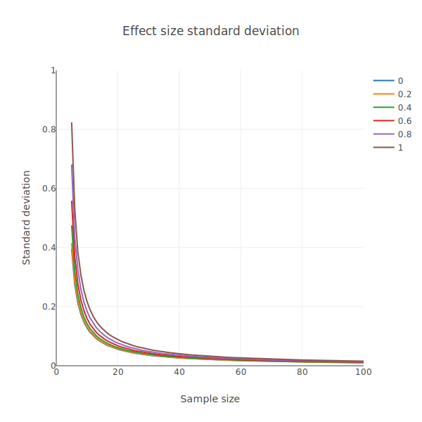

# Stopping rule based on effect size stabilization

## Stopping rule and side effects
Sample size is a critical parameter to consider when running experiments in psychology. This parameter partially determines the probability of detecting a true effect when sampling from a target population. In Null-Significance Hypothesis Testing (NHST), defining sample size using a stopping rule based on p-values leads to side effects. For instance, one can sample from the target population until the p-value reaches significance. This method of sampling from a population inflates type-1 error probabilities and effect sizes. In other words, implementing this method increases the probability of finding an effect when there is none and leads to larger effect sizes compared to what should theoretically be observed if such a stopping rule wasn't applied. Therefore, when applying this stopping rule, one ends up with a biased sample that is not representative of the target population.

## Effect size stabilization 
Recently, Anderson et al. (2022) proposed a method for implementing a stopping rule without inflating type-1 error probability. In this approach, the researcher samples from the population until the effect size stabilizes. Stabilization here refers to the absence of variation in the effect size throughout the sampling process, set against specific arbitrary thresholds. Consider an experiment where a researcher samples from the target population using a within-subject design. With each new participant added to the sample, the effect size (Cohen's d) is calculated. The difference between the obtained effect size and the previously observed effect size before adding the new participant is then assessed. If this difference doesn't exceed 0.05 for 5 consecutive iterations, the sampling process stops. Otherwise, the sampling process continues until reaching stabilization. This is the method proposed by Anderson et al. (2022).

## Type-1 and type-2 error probability
Anderson and colleagues tested the consequences of the effect size stabilization procedure on type-1 error probability by simulating imaginary experiments. Their results suggest that this way of performing a stopping rule does not lead to inflated type-1 error probability. However, what the study by Anderson and colleagues did not address is whether this method guarantees the observation of a true effect in the population. In other words, Anderson and colleagues did not address type-2 error probability, or power. The current project tackles this question directly.

# Simulations - Methods

Simulations were performed using the Rust programming language, and involved an imaginary scenarion where a researcher conducts an experiment. In this experiment, the researcher samples from a target population who presents a certain effect size $d$. The researcher starts from a base sample size of $N = 5$, and always increments the sample size by one observation (i.e., one more participant). After each increment, the researcher computes the new effect size. If the difference between successive effect sizes does not exceed 0.05 after a certain number of iteration $theta;$, the sampling process stops. Here, the $d$ and $theta;$ parameters are manipulated orthogonally. The $d$ parameter ranged from 0.0 (no effect size) to 1.0 with a step of 0.01. The $theta;$ parameter ranged from 5 to 100, with a step of 1. Each point in the parameter space involved 10,000 simulations. 

The following dependent variables were taken into account:

- The proportion of experiments leading to a significant p-value, considering $alpha; =  0.05$.
- The average sample size reached
- The average effect size reached
- The standard deviation of the effect sizes

# Simulations - Results

## Checking the stability assumption
The effect size stabilization method hinges on an implicit assumption that effect sizes stabilize over time. Essentially, if the same experiment is repeated many times, the distribution of effect sizes should show more variability for small than  large samples. The figure below displays results from 500 simulated experiments, where a researcher samples from a target population assuming a true effect size of $d = 0.5$. Each line in the figure represents the evolution of the effect size throughout the sampling process. As can be seen, the assumption is met: There is important variability among effect sizes at the beginning of the sampling process, and this variability decreases as more participants are added to the sample. This phenomenon merely reflects the fact that, in small samples, extreme variations have a more significant impact than in larger ones. Large samples, in contrast, tend to converge towards the true effect size of the population.

## Consequence on power
The next figure shows the consequence of the stopping rule on the observed power, as a function of the true effect size in the population (y axis) and the strictness of the stopping criterion (x axis). The brightness indicates the observed power. Bright and dark colors indicate high and low power, respectively. As can be seen, for big effect sizes (i.e., Cohen's d > 0.7), the researcher is almost guaranteed to observe a true effect. However, for smaller sample sizes, there is no guarantee that one would be able to observe something.

## Consequence on sample size
When implementing this stopping rule, what kind of sample size can a researcher expect to end up with? The next figure shows the sample size reached, averaged across simulations. As can be seen, regardless of the true effect size in the population, one ends up with a similar sample size. This is not a desirable property of the effect size stabilization procedure. As smaller effect sizes are more difficult to observe, one would normally expect to end up with larger samples when collecting data on a population in which the true effect size is small.

## Consequence on observed effect sizes
The next figure shows the observed effect sizes, averaged across simulations. As can be seen, one ends up with the true effect size in the population. This is a good sign because it shows that the effect size stabilization procedure does not inflate effect sizes, as initially reported by Anderson and colleagues.

Despite the consistency in the observed effect sizes, there is variability in the simulations. The next figure plots the standard deviation of the effect sizes across simulations. As can be seen,  although variability decreases with the strictness of the stopping rule, there is a systematic greater variability as effect sizes become larger.

## A deeper understanding of effect size variability
Why does one end up with a similar sample size for a different true effect size in the population after applying the stopping rule? The answer is partially provided by the previous figure and is deeply rooted in the properties of effect sizes, and specifically their variance. The next figure shows the standard deviation of different effect sizes across sample sizes, ranging from 5 to 100. As can be seen, smaller sample sizes exhibit a larger standard deviation, as expected. However, it is notable that bigger effect sizes display greater variability, especially at the beginning of the sampling process, where this variability can be twice as large. This variability decreases over the sampling process, eventually reaching an asymptote at around $N = 60$.

This observation entails two main consequences. First, by applying the stopping rule based on effect size stabilization, one might end up with a study that is underpowered. This is problematic, because if an effect is real, it is desirable to be able to detect it. Second, for an equivalent stopping rule, one might end up with a larger sample size for bigger than for smaller effect sizes, because effect sizes' variance increases with their size. This property is not desirable in a research setup where a researcher aims to observe a small effect.

One could argue that the stopping rule is perfectly suited in a situation where a researcher wishes to perform an experiment in which a big effect is expected. However, this logic contrasts with the initial purpose of using a stopping rule, that is, avoiding the use of a power analysis which requires an *apriori* knowledge of the effect size in the population. If the effect size is known, then the best option remains to perform a power analysis.

# Conclusion
Although the effect size stabilization procedure does not inflate type-1 error probability, it does not guarantee the ability to observe an effect in the population. It is therefore not recommended to blindly use this procedure to conduct an experiment, especially in situations where observing an effect might be challenging.
